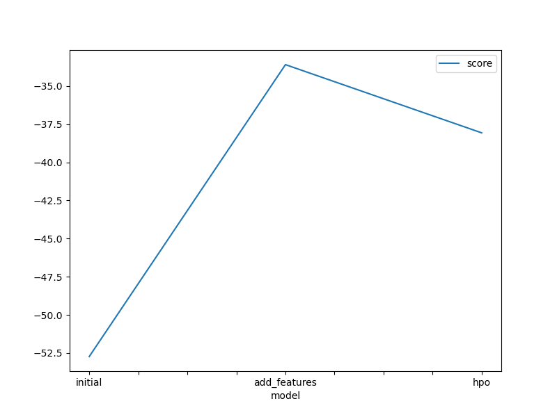
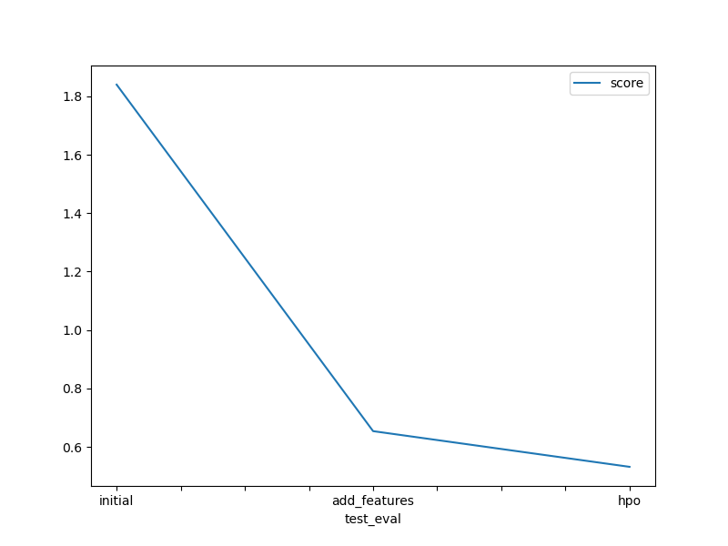

# Report: Predict Bike Sharing Demand with AutoGluon Solution
#### SEBASTIAN OBANDO MORALES

## Initial Training
### What did you realize when you tried to submit your predictions? What changes were needed to the output of the predictor to submit your results?

Only the requirement of not having negative numbers on the submission.

### What was the top ranked model that performed?

Last configuration with hpo and was WeightedEnsemble_L3

## Exploratory data analysis and feature creation
### What did the exploratory analysis find and how did you add additional features?

It helps understand the behavior between and within variables and the need for a time-based variable, in this case, a good one hour.

### How much better did your model preform after adding additional features and why do you think that is?

Because there's always a strong correlation between time and availability in any sharing system, due to the domain understanding of demand on high and low time frames.

## Hyper parameter tuning
### How much better did your model preform after trying different hyper parameters?

It drops 0.1 points, which less is better.

### If you were given more time with this dataset, where do you think you would spend more time?

Doing more feature engineering.

### Create a table with the models you ran, the hyperparameters modified, and the kaggle score.

|model|hpo1|hpo2|hpo3|score|
|--|--|--|--|--|
|initial|default|default|default|1.84007|
|add_features|default|default|default|0.65378|
|hpo|bootstrap: True|max_depth: 10|max_leaf_nodes: 15000|0.53159|

### Create a line plot showing the top model score for the three (or more) training runs during the project.

### Create a line plot showing the top kaggle score for the three (or more) prediction submissions during the project.

## Summary

All the machine learning inference part was almost handled by AutoGluon, which makes it quite easy to focus more on the quality of the data than on the modeling and predicting part. 
