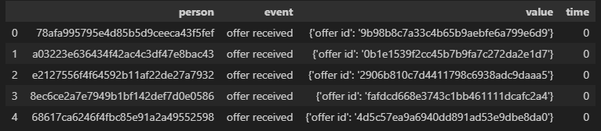
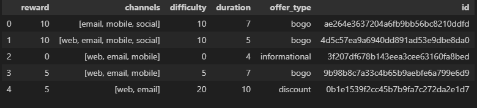
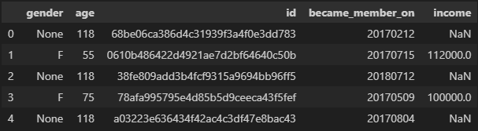
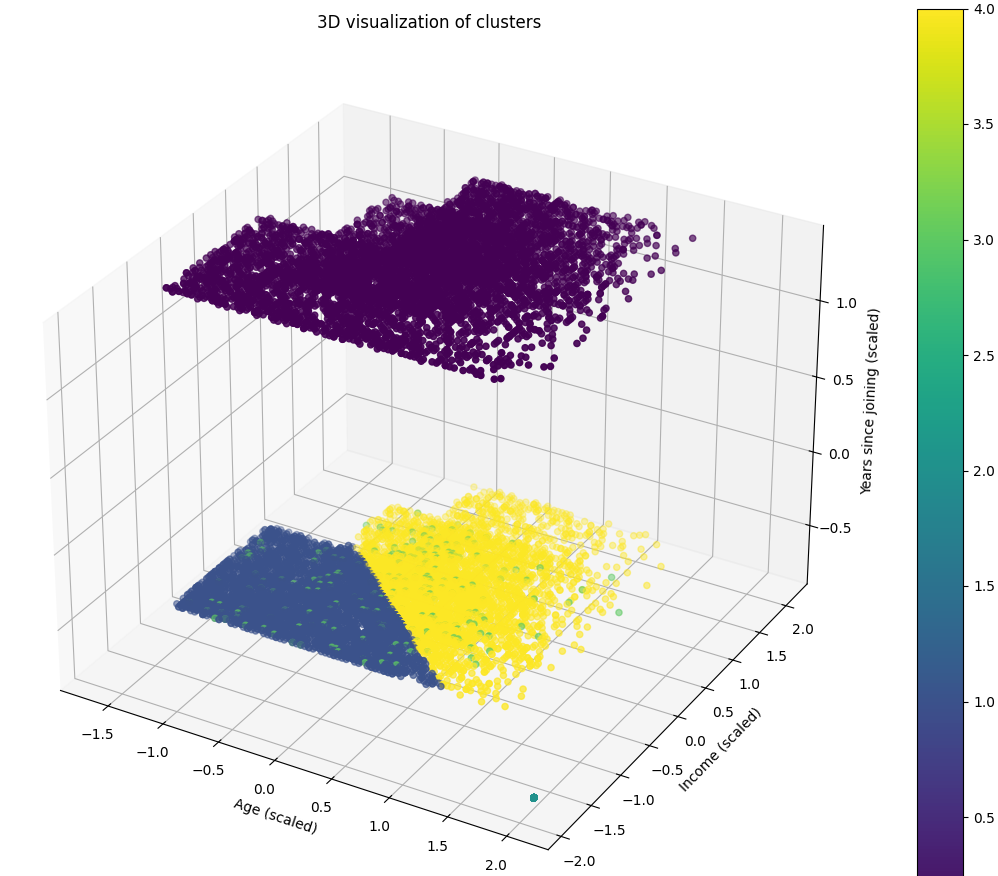
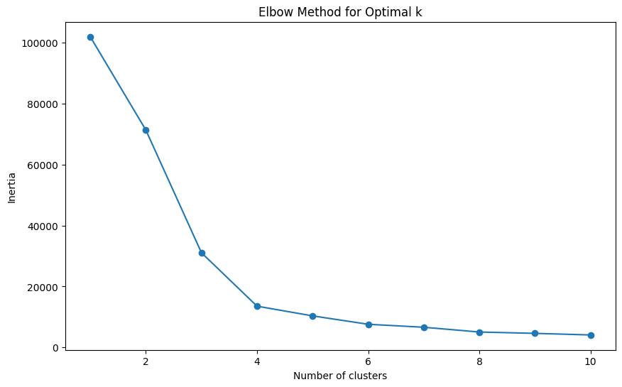
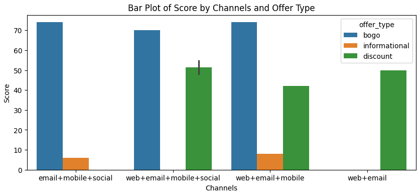
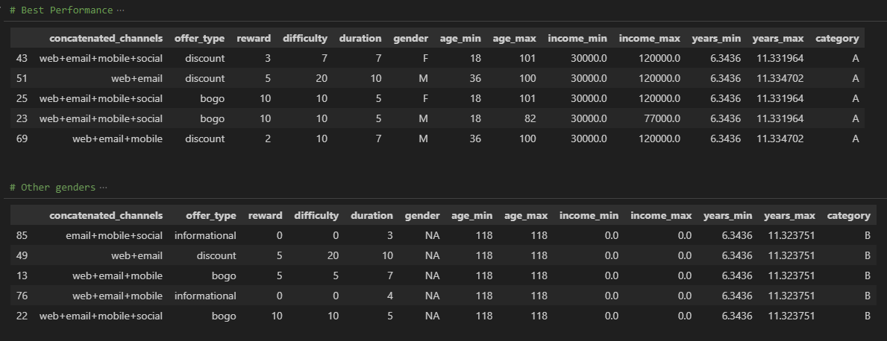
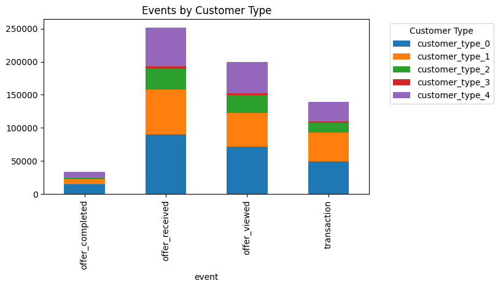
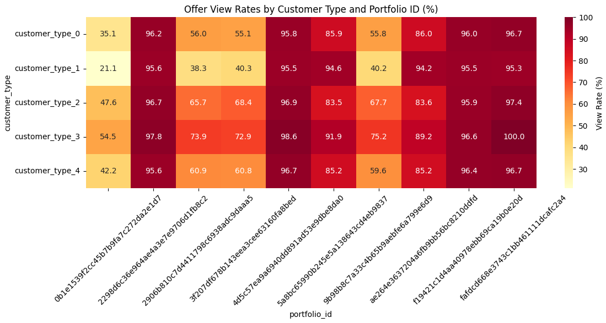
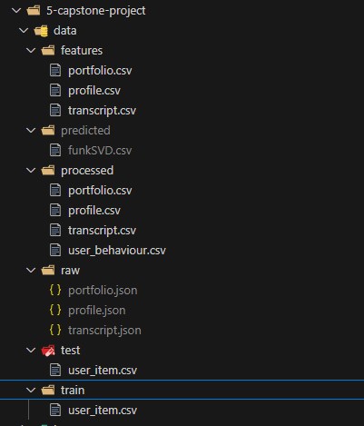

# Definition

## Project Overview

<!--
Student provides a high-level overview of the project in layman’s terms. Background information such as the problem domain, the project origin, and related data sets or input data is given.
-->

The selected project is the **Starbucks Project**, one of the three default options available. This project focuses on determining which type of offer—Buy One Get One (BOGO), discounts, or informational messages—should be sent to a list of customers based on synthetic demographic and transactional data. The reason I picked this project is because I don’t have experience building recommendation systems and could be a good chance to learn how to build one.

About historical information from Starbucks:

**Company Background:** Starbucks was founded in 1971 in Seattle, Washington, initially as a retailer of whole bean and ground coffee. Over the years, it has transformed into a global coffeehouse chain, renowned for its specialty coffee drinks and unique customer experience. By the late 1990s, Starbucks began an aggressive expansion strategy, opening stores across the United States and internationally (Michelli, 2007).

**Market Trends:** The coffee industry has undergone significant changes since Starbucks' inception. The rise of specialty coffee in the 1990s led to increased consumer interest in high-quality coffee. Additionally, the trend towards sustainability and ethical sourcing has influenced Starbucks' practices, resulting in initiatives such as the Coffee and Farmer Equity (C.A.F.E.) Practices (Starbucks, 2021).

**Previous Research:** Numerous studies have analyzed Starbucks' business model, focusing on its customer loyalty programs, brand positioning, and marketing strategies. Research indicates that Starbucks has successfully created a "third place" environment, fostering customer loyalty through a distinctive in-store experience (Michelli, 2007; Schmitt, 
2010).

**Technological Advances:** Starbucks has embraced technology to enhance customer experience, introducing mobile ordering and payment systems in 2015. The Starbucks app has become a key tool for customer engagement, allowing users to earn rewards and customize their orders (Starbucks, 2021).

***Competitor Analysis:** Starbucks faces competition from various coffee chains and independent cafés. Its ability to adapt to changing consumer preferences, such as the demand for healthier options and plant-based products, has been crucial in maintaining its market leadership (Smith, 2020).

**Customer Engagement:** Starbucks employs a variety of marketing strategies, including seasonal promotions and community involvement initiatives. The company's emphasis on creating a personalized customer experience has been a significant factor in its success (Michelli, 2007).
The reason I chose this project is that I lack experience in building recommendation systems, and this presents a valuable opportunity to learn how to create one.

**References:**

- Michelli, J. A. (2007). The Starbucks Experience: 5 Principles for Turning Ordinary Into Extraordinary. McGraw-Hill.
- Schmitt, B. H. (2010). Customer Experience Management: A Revolutionary Approach to Connecting with Your Customers. Wiley.
- Smith, A. (2020). The Coffee Market: Trends and Opportunities. Journal of Business Research, 112, 123-134.
- Starbucks. (2021). Global Environmental & Social Impact Report. Retrieved from Starbucks.

## Datasets and Inputs

The proposal uses three datasets provided by Udacity, it includes data about customers (profile.json), offers (portfolio.json), and transactions (transcript.json), described as follows:

profile.json: Rewards program users (17000 users x 5 fields):
- gender: (categorical) M, F, O, or null
- age: (numeric) missing value encoded as 118
- id: (string/hash)
- became_member_on: (date) format YYYYMMDD
- income: (numeric)

portfolio.json: Offers sent during the 30-day test period (10 offers x 6 fields):
- reward: (numeric) money awarded for the amount spent
- channels: (list) web, email, mobile, social
- difficulty: (numeric) money required to be spent to receive a reward
- duration: (numeric) time for the offer to be open, in days

offer_type: (string) bogo, discount, informational
- id: (string/hash)
- transcript.json: Event log (306648 events x 4 fields)
- person: (string/hash)
- event: (string) offer received, offer viewed, transaction, offer completed
- value: (dictionary) different values depending on event type
- offer id: (string/hash) not associated with any "transaction"
- amount: (numeric) money spent in "transaction"
- reward: (numeric) money gained from "offer completed"
- time: (numeric) hours after the start of the test

The importance of these datasets comes from understanding, 1)  the offers and their components, 2) who are the target customers and 3) historical transactions, by combining these three aspects we would be able to understand who (customers) are more likely to react to a specific situation ( a type of offer) according to historical behavior (transactions).

## Problem Statement

<!--
The problem which needs to be solved is clearly defined. A strategy for solving the problem, including discussion of the expected solution, has been made.
-->

According to the project definition provided by Udacity: the basic task is to use the data to identify which groups of people are most responsive to each type of offer, and how best to present each type of offer.

## Metrics

<!--
Metrics used to measure the performance of a model or result are clearly defined. Metrics are justified based on the characteristics of the problem.
-->

- **Accuracy Metrics:** Precision, Recall and F1-Score
- **Error Metrics:** Mean Absolute Error (MAE) and Root Mean Squared Error (RMSE)
- **Ranking Metrics:** Mean Average Precision (MAP) and Normalized Discounted Cumulative Gain (NDCG)

# Analysis

## Data Exploration

<!--
If a dataset is present, features and calculated statistics relevant to the problem have been reported and discussed, along with a sampling of the data. In lieu of a dataset, a thorough description of the input space or input data has been made. Abnormalities or characteristics of the data or input that need to be addressed have been identified.
-->

The data for transcript looks like:

Required transformations would be:

- Rename person to profile_id.
- Unnest the value to get the "offer id" and any hidden value.

The data for portfolio looks like:

Required transformations would be:

- Rename id to portfolio_id
- Explode or convert to string the channels columns

The data for profile looks like:

- Rename the id to profile_id.
- Convert the became_member_on to a date

The model data:

According to the analysis could be generated by using transcript to join profile and portfolio with the ids of person as profile_id and "offer id" as portfolio_id.

## Exploratory Visualization

<!--
A visualization has been provided that summarizes or extracts a relevant characteristic or feature about the dataset or input data with thorough discussion. Visual cues are clearly defined.
-->

### Proposal exploration

A EDA was run in the notebook [proposal_exploration](notebooks/analysis/proposal_exploration.ipynb), to understand which pattern could be found, what transformations were needed to enhance the data and a initial approximation of how to recommend offers based on demographic characteristics.

From this initial approach a customer_type was generated based on a k-means model:

And according to the elbow method 5 clusters would be enough to represent the profile data:

Next the portfolio was simplified by representing the duration, reward and difficulty in one metric called score. The calculation was a standarization of duration and reward based on the max value and the difficulty based on the min value so that for the first two cases the higher the value the better and the difficulty the lower the value the better and then weighted and sum as follows:

$score = (reward * 0.4) + (difficulty * 0.4) + (duration * 0.2)$

This was another representation of portfolio metrics:

Finally a second cluster was generated to identify potential preferencias between demographic clusters and offers based on the portfolio scores:

## Estimating scores

After the first exploration, the next iteration was to understand if it was possible to represent the transcript data into a score or rating evaluation per user per offer, by undestarting the event field, it was possible to propose a score as:

$score = (\text{number of offers viewed}) / (\text{number of offers received})$

And by estimating the global scores per customer type was possible to optain a second approximation to build intuition around the recomendation:

## Algorithms and Techniques

<!--
Algorithms and techniques used in the project are thoroughly discussed and properly justified based on the characteristics of the problem.
-->

For recomendation system a powerful algorithm would be the funkSVD, the one used in the Netflix 1 MM competition, that based on latent features and rating is able to suggest movies, even for N/A values which is kind of a problem in matrix operations.

The algorithm can be found on [funkSVD](notebooks/modeling/funkSVD.ipynb) and the training to build recomendation systems comes from the "Experimental Design and Recommendations" course offered by Udacity.

## Benchmark

<!--
Student clearly defines a benchmark result or threshold for comparing performances of solutions obtained.
-->

The selected benchmark model for funkSVD is a collaborative filter using the Mahalanobis distance as personal preferences over euclidean or manhattan. 

# Methodology

This project was build by following these steps:

## Data Preprocessing

<!--
All preprocessing steps have been clearly documented. Abnormalities or characteristics of the data or input that needed to be addressed have been corrected. If no data preprocessing is necessary, it has been clearly justified.
-->

The preprocessing was done using the following notebooks:

- [portfolio](notebooks/preprocessing/portfolio.ipyn)
- [profile](notebooks/preprocessing/profile.ipyn)
- [transcript](notebooks/preprocessing/transcript.ipyn)
- [user_behaviour](notebooks/preprocessing/user_behaviour.ipyn)

The feature engineering was done using the following notebooks:

- [portfolio](notebooks/feature_engineering/portfolio.ipyn)
- [profile](notebooks/feature_engineering/profile.ipyn)
- [transcript](notebooks/feature_engineering/transcript.ipyn)
- [user_item](notebooks/feature_engineering/user_item.ipyn)

The structure of the data store looks like:

## Implementation

<!--
The process for which metrics, algorithms, and techniques were implemented with the given datasets or input data has been thoroughly documented. Complications that occurred during the coding process are discussed.
-->

The notebooks used for funkSVD and collaborative filtering can be found here:

- [funkSVD](notebooks/modeling/funkSVD.ipynb)
- [collaborative_filtering](notebooks/modeling/funkSVD.ipynb)

# Results

## Model Evaluation and Validation

<!--
The final model’s qualities—such as parameters—are evaluated in detail. Some type of analysis is used to validate the robustness of the model’s solution.
-->

| Metric                              | Collaborative Filters - Mahalanobis | funkSVD                         |
|-------------------------------------|-------------------------------------|---------------------------------|
| Precision                           | 0.9665629860031104                  | 0.7746802230239422              |
| Recall                              | 0.13082833385959372                 | 0.9944216398273866              |
| F1-Score                            | 0.23046259386298323                 | 0.8709038115868554              |
| Mean Absolute Error (MAE)           | 0.6623985560350677                  | 0.26560995393393005             |
| Root Mean Squared Error (RMSE)      | 0.808610202792579                   | 0.46353163478869763             |
| Mean Average Precision (MAP)        | 0.8108887343201155                  | 0.8843025214690233              |
| Normalized Discounted Cumulative Gain (NDCG) | 0.9755457340548795                  | 0.9844160683366693              |

# Results Comparison

## Justification

<!--
The final results are compared to the benchmark result or threshold with some type of statistical analysis. Justification is made as to whether the final model and solution is significant enough to have adequately solved the problem.
-->

- **Precision**: Collaborative Filters - Mahalanobis has higher precision, meaning it is more accurate when it predicts a positive class.
- **Recall**: funkSVD has significantly higher recall, capturing almost all actual positive cases.
- **F1-Score**: funkSVD has a much higher F1-Score, indicating a better balance between precision and recall.
- **MAE and RMSE**: funkSVD has lower MAE and RMSE, indicating more accurate predictions.
- **MAP and NDCG**: funkSVD has slightly higher MAP and NDCG, indicating better ranking performance.

